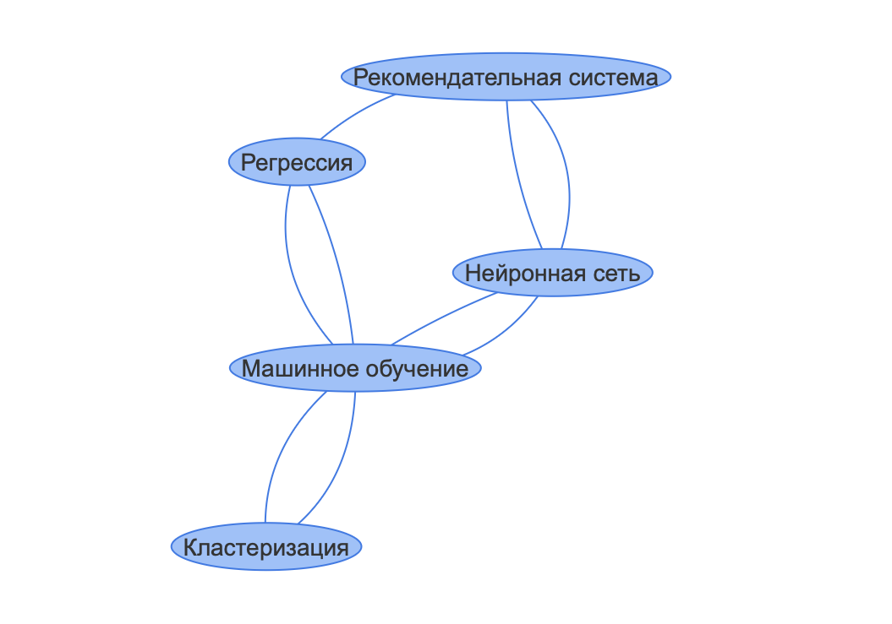

# Глоссарий терминов

Проект реализует глоссарий терминов по теме ВКР с веб-интерфейсом и API.

- Backend: **FastAPI + SQLModel + SQLite**
- Frontend: HTML-страница с визуализацией графа терминов (MindMap)
- Контейнеризация: **Docker**

## Развертывание и запуск

### Локальный запуск без Docker

1. Установить зависимости:

```bash
pip install -r requirements.txt
```

2. Запустить сервер:

```bash
uvicorn app.main:app --reload
```

3. В браузере:

- API-документация: `http://127.0.0.1:8000/docs`
- Фронтенд: `http://127.0.0.1:8000/static/index.html`

### Запуск через Docker

1. Построить образ:

```bash
docker build -t glossary-api .
```

2. Запустить контейнер:

```bash
docker run -p 8000:8000 glossary-api
```

## Примеры работы API

### Получение списка всех терминов

```
GET /api/terms
```

### Получение термина по ключевому слову

```
GET /api/terms/Машинное обучение
```

### Добавление нового термина

```
POST /api/terms
```

Body (JSON):

```json
{
  "term": "Регрессия",
  "definition": "Метод прогнозирования числовых значений на основе признаков.",
  "related_terms": "[1]"
}
```

### Обновление существующего термина

```
PUT /api/terms/3
```

Body (JSON):

```json
{
  "definition": "Обновленное определение термина Регрессия."
}
```

### Удаление термина

```
DELETE /api/terms/3
```

## Граф терминов

API `/api/graph` возвращает JSON с узлами и рёбрами для визуализации:

```json
{
  "nodes": [
    { "id": 1, "label": "Машинное обучение", "title": "..." },
    { "id": 2, "label": "Нейронная сеть", "title": "..." }
  ],
  "edges": [
    { "from": 1, "to": 2 },
    { "from": 1, "to": 3 }
  ]
}
```

## Визуализация графа


